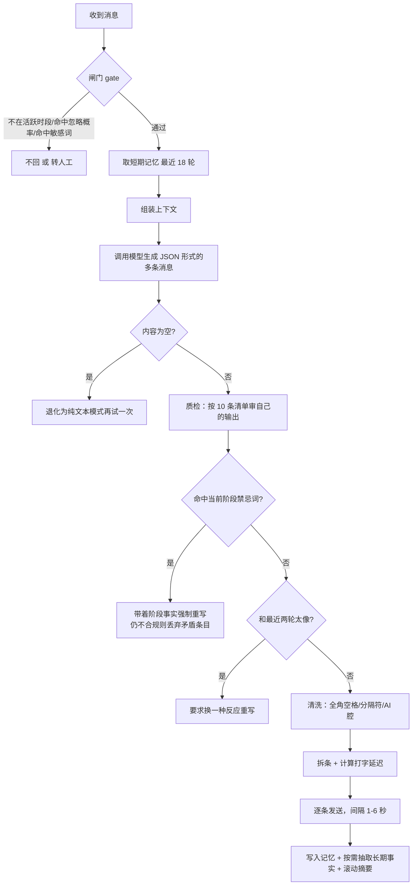

# 二、系统架构与数据流

## 2.1 分层

```
┌────────────────────────── 接入层（adapters/） ──────────────────────────┐
│  terminal.py      终端试聊（开发调试主力）                              │
│  onebot.py        QQ —— OneBot 11 协议，HTTP 服务端 + 主动发消息         │
│  wxauto_adapter.py 个人微信（已失效，见 04-踩坑）                        │
│  wecom.py         企业微信（官方回调，合规通道）                          │
└────────────────────────────────┬───────────────────────────────────────┘
                                 │  统一成 (chat_id, sender, text)
┌────────────────────────────────▼───────────────────────────────────────┐
│                        编排层  engine.py（830 行，核心）                 │
│  闸门 → 组装上下文 → 生成 → 质检 → 硬约束 → 重复检测 → 拆条 → 节奏发送   │
└───┬──────────────┬──────────────┬───────────────┬──────────────────────┘
    │              │              │               │
┌───▼────┐  ┌──────▼─────┐  ┌─────▼──────┐  ┌─────▼──────┐
│persona │  │  memory    │  │  reality   │  │  clock     │
│人格档案 │  │ 记忆系统    │  │ 现实背景    │  │ 时间感知    │
│+提示词  │  │SQLite 三层  │  │校历/节假日  │  │8 时段/夜猫子│
└───┬────┘  └────────────┘  └────────────┘  └────────────┘
    │
┌───▼────┐  ┌────────────┐  ┌────────────┐
│style   │  │ retriever  │  │  llm.py    │
│风格统计 │  │ BM25 检索   │  │ 模型调用    │
└────────┘  └────────────┘  └────────────┘
```

设计原则：**上层只负责"把话送到"，下层只负责"决定说什么"**。
接入层换来换去（微信 → QQ → 企业微信）都不影响编排层，这是能三次切换方案还不崩的原因。

## 2.2 一次回复的完整链路

以"对方发来一句『你现在在哪』"为例，实际发生的 9 步：



关键点：**这是一条带反馈的流水线，不是一次 API 调用**。
每一步都可能否决上一步的结果，这一层套一层的设计是被真实的翻车逼出来的。

## 2.3 上下文的组装顺序（很关键）

模型每轮收到的 system 消息是**分层排布**的，顺序本身就是设计：

| 顺序 | 内容 | 为什么放这里 |
| --- | --- | --- |
| 1 | 人格档案全文（约 1.5 万字节） | 最基础的世界观，必须最先建立 |
| 2 | 长期事实（对方以前提过的事） | 补充信息，用不上就不看 |
| 3 | 滚动摘要（"最近聊过什么"） | **必须紧跟着注明"和下面的现实背景冲突时以现实背景为准"** |
| 4 | 真实语料检索结果 | 只在需要时开；开启时明确写"只学语气，不要照抄" |
| 5 | 最近用过的口头禅黑名单 | 防止口头禅复读 |
| 6 | 最近两条自己说过的话 | 防止同一套句式循环 |
| 7 | 当前时段（几点、在干嘛） | 时间感 |
| 8 | **绝对不可能的说法清单** | 阶段禁忌，位置靠后才有分量 |
| 9 | 现实背景（学校、阶段、校历、假期） | 事实依据 |
| 10 | 最近 18 轮对话原文 | |
| 11 | **关键事实（放假日期、军训还剩几天）** | 放在最后、紧贴用户消息——放前面会被上万字档案稀释 |
| 12 | 用户当前这句话 | |

第 11 条是实测得出的经验：把"你现在确定知道的几件事"放在**紧挨用户消息**的位置，
命中率明显高于放在前面的档案里（近因效应）。

## 2.4 模块职责

| 模块 | 行数 | 职责 | 关键设计 |
| --- | --- | --- | --- |
| `chatlog.py` | 236 | 多格式聊天记录解析（txt/csv/json） | 说话人切分、消息类型识别（文本/图片/系统消息）、OCR 空格归一化后再匹配系统消息 |
| `style.py` | 269 | 本地语言风格统计 | n-gram 文档频次 + 子串抑制去冗余；过滤功能词、界面词、纯字母串 |
| `persona.py` | 520 | 人格档案生成 + 系统提示词渲染 | 启发式统计与大模型语义分析合并；提示词分区渲染 |
| `retriever.py` | 123 | BM25 真实语料检索 | 纯标准库实现，零依赖 |
| `memory.py` | 135 | SQLite 会话记忆 | `msgs`（原文）/ `facts`（长期事实）/ `kv`（摘要）三张表 |
| `clock.py` | 134 | 时间感知 | 8 个时段 × 4 种阶段（军训/假期/上课/待开课）四套作息文案 |
| `reality.py` | 496 | 现实背景 | 校历状态机、节假日数据、阶段禁忌词、生成后硬校验 |
| `engine.py` | 830 | 回复编排 | 闸门、上下文组装、生成、质检、硬约束、拆条、节奏 |
| `llm.py` | 186 | 模型调用 | OpenAI 兼容协议，含离线 mock 供自检使用 |
| `feeder.py` | 258 | 一键投喂 | 截图 OCR → 语料 → 重建人格 |
| `sanitize.py` | 11 | 输入清洗 | 过滤非法代理字符（Windows 管道编码残渣），否则存库/发模型都会崩 |

## 2.5 记忆的三层结构

```
┌─────────────────────────────────────────────────────────┐
│ 短期：最近 18 轮原文                                      │
│   直接读 SQLite msgs 表，原样进上下文。保证"接得上话"。     │
├─────────────────────────────────────────────────────────┤
│ 长期：事实表 facts（最多 12 条）                          │
│   从对话里抽取"对方提到过的客观信息"（在哪个城市、几点起、   │
│   关心什么）。带【修正要求】前缀的会被当成硬规则优先注入。    │
├─────────────────────────────────────────────────────────┤
│ 滚动摘要：每 12 条消息压缩一次（kv 表，上限 900 字）        │
│   把"最近聊过什么"压成 5-8 行，用于跨时段的连贯。           │
│   ⚠️ 这一层是记忆污染的入口，见 04 文档第 5 条。            │
└─────────────────────────────────────────────────────────┘
```

## 2.6 目录结构

```
mimesis-persona-engine/
├── run.py                    统一入口
│                              init / import / profile / chat / feed /
│                              qq / wechat / wecom / inspect / refresh / selftest
├── config.example.json       配置模板（真实 config.json 已被 gitignore）
├── requirements.txt          说明：主流程零依赖
├── README.md                 使用手册
├── docs/                     ← 本目录，项目复盘
├── bot/
│   ├── chatlog.py            聊天记录解析
│   ├── style.py              语言风格统计
│   ├── persona.py            人格档案 + 提示词渲染
│   ├── retriever.py          BM25 检索
│   ├── memory.py             记忆（SQLite 三层）
│   ├── clock.py              时间感知
│   ├── reality.py            现实背景 + 阶段硬约束
│   ├── engine.py             回复编排（核心）
│   ├── llm.py                模型调用
│   ├── feeder.py             一键投喂
│   ├── sanitize.py           输入清洗
│   └── adapters/             terminal / onebot(QQ) / wxauto(微信) / wecom
├── tools/                    OCR 脚本、导入工具、环境配置脚本
├── samples/sample_chat.txt   示例语料（可直接跑通 profile）
└── personas/ data/ work/     运行产物（已被 gitignore）
```
