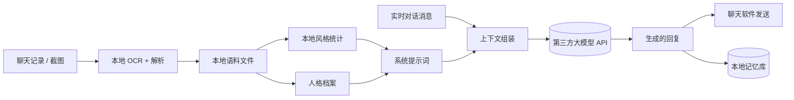

# 五、隐私、风险与合规

这一份不是客套话，是这个项目里必须正视的部分：
**它处理的是别人的私人聊天记录，并且会把内容发到第三方服务器。**

---

## 5.1 数据流向（务必清楚）



关键结论：**箭头 I 是唯一离开你电脑的一步，但它带走了很多**——
每一轮对话原文、人格档案全文（含从真实聊天记录里提炼的表达习惯与示例）、
记忆摘要、以及当前阶段的现实背景，都会随请求发到模型服务商。

也就是说：**聊天记录的内容会离开本机**。这是这套方案绕不开的代价。

## 5.2 这个仓库里绝对不能提交的东西

`.gitignore` 已经处理，逐条说明为什么：

| 路径 | 内容 | 为什么不能提交 |
| --- | --- | --- |
| `config.json` | **大模型 API 密钥** | 密钥泄露 = 别人用你的账户花钱 |
| `data/` | 记忆数据库（对话原文、摘要、事实） | 私人对话内容 |
| `work/` | 语料文件、OCR 中间产物、截图 | 私人聊天记录原文 |
| `personas/` | 人格档案（含说话习惯、示例、学校专业等） | 指向具体的人 |
| `*.lnk` | Windows 快捷方式 | 含本机绝对路径与用户名 |
| `__pycache__/` `*.pyc` | 编译缓存 | 无意义且与机器相关 |

提供的替代品：`config.example.json`（模板，密钥留空）+ `samples/sample_chat.txt`
（虚构示例语料，可直接跑通全流程）。

## 5.3 公开仓库前的脱敏清单

即使 `.gitignore` 挡住了私人数据，**代码里仍然有指向真实身份的信息**。
在这个项目里，`bot/reality.py` 写死了某所具体高校的校历数据：

```python
SCHOOL = {"name": "<真实校名>", "campus": "...", "city": "..."}
TERMS = ({"military_training": ("2026-09-07", "2026-09-24"), "class_start": "2026-09-28", ...})
MAJOR_COURSES = {"数据": (...), "软件": (...)}
```

这些信息再加上"2026 级大一"，足以定位到一个具体的人。公开前建议：

1. 把 `SCHOOL` / `TERMS` / `MAJOR_COURSES` 替换成**示例值**（或抽成
   `bot/school_calendar.json` 并加入 `.gitignore`）
2. 检查 `docs/` 里是否残留真实校名、专业、日期
3. 检查 README 里的效果示例——用虚构语料，不要贴真实对话
4. `git log -p` 扫一遍历史提交，确认没有旧版本误提交过密钥
5. 密钥如果曾经提交过：**不要只删文件**，要立刻去服务商后台作废并重新生成

> 本目录下的复盘文档已经做了脱敏：涉及具体身份的地方用"某高校 / 示例语料"表述。

## 5.4 账号与风控风险

| 做法 | 风险 | 建议 |
| --- | --- | --- |
| QQ 走 NapCat（协议端） | 属于非官方途径，账号存在被限制的可能 | **务必用不常用的小号**，不要用主号；不要高频大量发送 |
| 微信走窗口自动化 | 官方客户端升级即失效（已实测被拦） | 不作为主方案 |
| 企业微信官方接口 | 合规，但需要公网回调地址、有主体要求 | 需要长期稳定时优先考虑 |
| 机器人自动加好友 / 群发 | 极易触发风控 | 只做被动回复，不做主动营销式行为 |

程序里已有的自我保护：每分钟最多 12 条、回复前 2 秒冷却、
随机忽略 8% 的消息、只在配置的活跃时段内工作——这些既是"拟人化"，
客观上也降低了被判定为机器人的概率。

## 5.5 使用边界（写给后来的使用者）

这个项目的出发点是**私人趣味 + 技术探索**。上线前请想清楚这几件事：

1. **被模仿的人是否知情并同意**。把别人的聊天记录喂给模型、让模型以对方的口吻说话，
   涉及对方的人格与隐私。私人自用和公开传播是两件事。
2. **不要用于欺骗**。不要让机器人冒充真人去和第三个人建立关系、谈钱、作承诺。
3. **敏感信息过滤**。项目内置了敏感词拦截（借钱、转账、银行卡、身份证、验证码、
   密码、投资、赌博等），命中时不做角色扮演，转人工处理。这条建议不要关。
4. **不要喂不该喂的东西**。身份证号、银行卡、家庭住址、他人隐私——既不进语料，也别进对话。
5. **数据清理**：不再使用时，删掉 `data/`、`work/`、`personas/` 三个目录，
   并到模型服务商后台删除/关闭相关记录与密钥。

## 5.6 成本

模型接口按量计费。一次回复实际会调用 **1-3 次**模型：

| 调用 | 触发条件 | 占比 |
| --- | --- | --- |
| 主生成 | 每次回复 | 100% |
| 质检重写 | 命中清单问题时 | 视质量而定 |
| 阶段硬约束重写 | 命中禁忌词时 | 少 |
| 摘要压缩 | 每 12 条消息一次 | 约 8% |
| 长期事实抽取 | 周期性 | 少 |

余额耗尽时的表现是"调用模型失败"，程序会把真实原因打到日志里，不会静默失灵
（这一点是刻意的：只说"没有产出内容"会让使用者完全无从排查）。
